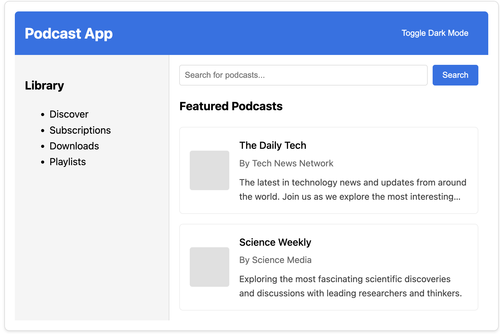

# Podcast App

A modern, responsive podcast application built with React, featuring a beautiful dashboard interface, PWA support, and offline capabilities.



## ✨ Features

- 🎧 Browse and search podcasts
- 📱 Responsive design that works on all devices
- 🌓 Light/Dark mode support
- ⚡ Progressive Web App (PWA) with offline support
- 🎨 Modern UI with smooth animations
- 📱 Installable on mobile devices
- 🔔 Browser notifications
- 🚀 Real-time audio transcription
- 🔄 WebSocket support for live updates

## 🚀 Getting Started

### Prerequisites

- Node.js 16+ and npm 8+
- Modern web browser
- Python 3.8+ (for audio transcription)
- FFmpeg (for audio processing)

### Installation

1. Clone the repository:
   ```bash
   git clone https://github.com/wuchunkin/Podcast.git
   cd Podcast
   ```

2. Install dependencies:
   ```bash
   # Install Node.js dependencies
   npm install
   
   # Install Python dependencies (for transcription)
   pip install -r requirements.txt
   ```

3. Set up environment variables:
   Create a `.env` file in the root directory with the following variables:
   ```env
   PORT=3000
   NODE_ENV=development
   WHISPER_MODEL=base  # or 'small', 'medium', 'large' based on your needs
   ```

4. Start the development server:
   ```bash
   # Start the backend server
   npm run server
   
   # In a new terminal, start the frontend
   npm start
   ```
   The app will be available at [http://localhost:3000](http://localhost:3000)

## 🛠 Available Scripts

- `npm start` - Starts the frontend development server
- `npm run server` - Starts the backend server with hot-reload
- `npm run build` - Builds the app for production to the `build` folder
- `npm test` - Launches the test runner
- `npm run lint` - Runs ESLint to check code quality
- `npm run format` - Formats code using Prettier
- `npm run generate:docs` - Generates API documentation

## 🏗 Project Architecture

### Frontend Structure
```
public/
└── components/         # Frontend React components
    ├── PodcastSearch.js      # Search input and form
    ├── PodcastList.js        # Paginated podcast results
    ├── PodcastDetails.js     # Detailed podcast view with episodes
    └── AudioTranscription.js # Transcription functionality

src/
├── components/        # Reusable React components
│   ├── layout/       # Layout components
│   ├── pages/        # Page components
│   └── ui/           # UI components (buttons, inputs, etc.)
├── hooks/            # Custom React hooks
├── services/         # API and service layer
├── styles/           # Global styles and theme
└── utils/            # Utility functions and helpers
```

### Backend Structure
```
src/
├── controllers/           # API route handlers
│   ├── podcastController.js
│   └── transcriptionController.js
├── services/             # Business logic
│   └── transcriptionService.js
├── middleware/           # Express middleware
│   └── uploadMiddleware.js
├── websocket/           # WebSocket handlers
│   └── transcriptionHandler.js
└── utils/               # Utility functions
    ├── responseHelper.js
    └── swaggerConfig.js
```

## 🛠 Development Guide

### Key Refactoring Improvements

#### 1. Backend Architecture
- **Modular Controllers**: Separated concerns with dedicated controllers
- **Service Layer**: Business logic encapsulated in service classes
- **WebSocket Support**: Real-time updates for transcription
- **API Documentation**: Auto-generated with Swagger

#### 2. Frontend Improvements
- **Component-Based Architecture**: Reusable, maintainable components
- **State Management**: Context API for global state
- **Responsive Design**: Works on all device sizes
- **Progressive Enhancement**: Core functionality works without JavaScript

#### 3. Security Enhancements
- File upload validation
- Proper CORS handling
- Input sanitization
- Secure file storage

## 📱 PWA Features

This app is a Progressive Web App, which means:

- Works offline
- Installable on your device's home screen
- Fast loading with service worker caching
- Push notifications support

## 🌈 Theming

The app supports both light and dark modes, which automatically adapts to your system preferences. You can also toggle between themes manually in the settings.

## 🧪 Testing

Run the test suite with:
```bash
npm test
```

## 📚 API Documentation

Access the interactive API documentation at `/api-docs` when the development server is running.

## 🤝 Contributing

1. Fork the repository
2. Create a feature branch (`git checkout -b feature/AmazingFeature`)
3. Commit your changes (`git commit -m 'Add some AmazingFeature'`)
4. Push to the branch (`git push origin feature/AmazingFeature`)
5. Open a Pull Request

Please read [CONTRIBUTING.md](CONTRIBUTING.md) for details on our code of conduct and the process for submitting pull requests.

## 📄 License

This project is licensed under the MIT License - see the [LICENSE](LICENSE) file for details.

```text
MIT License

Copyright (c) 2025 Podcast App Contributors

Permission is hereby granted, free of charge, to any person obtaining a copy
of this software and associated documentation files (the "Software"), to deal
in the Software without restriction, including without limitation the rights
to use, copy, modify, merge, publish, distribute, sublicense, and/or sell
copies of the Software, and to permit persons to whom the Software is
furnished to do so, subject to the following conditions:

The above copyright notice and this permission notice shall be included in all
copies or substantial portions of the Software.

THE SOFTWARE IS PROVIDED "AS IS", WITHOUT WARRANTY OF ANY KIND, EXPRESS OR
IMPLIED, INCLUDING BUT NOT LIMITED TO THE WARRANTIES OF MERCHANTABILITY,
FITNESS FOR A PARTICULAR PURPOSE AND NONINFRINGEMENT. IN NO EVENT SHALL THE
AUTHORS OR COPYRIGHT HOLDERS BE LIABLE FOR ANY CLAIM, DAMAGES OR OTHER
LIABILITY, WHETHER IN AN ACTION OF CONTRACT, TORT OR OTHERWISE, ARISING FROM,
OUT OF OR IN CONNECTION WITH THE SOFTWARE OR THE USE OR OTHER DEALINGS IN THE
SOFTWARE.
```

## 📝 Third-Party Licenses

This application includes open source software components that are licensed under their own respective licenses. See the `node_modules` directory for more information about third-party licenses.

## 📜 Compliance Guidelines

To comply with the MIT License, please ensure that:

1. The original copyright notice is included in all copies or substantial portions of the software.
2. The full license text is included in all distributions of the software.
3. Any substantial changes to the code are documented.

For more information, please see the [full license text](LICENSE).

## 🙏 Acknowledgments

- Built with [React](https://reactjs.org/)
- Styled with [Tailwind CSS](https://tailwindcss.com/)
- Icons from [React Icons](https://react-icons.github.io/react-icons/)
- State management with [React Context API](https://reactjs.org/docs/context.html)
- Audio transcription with [OpenAI Whisper](https://openai.com/research/whisper)
- Real-time updates with [Socket.IO](https://socket.io/)
