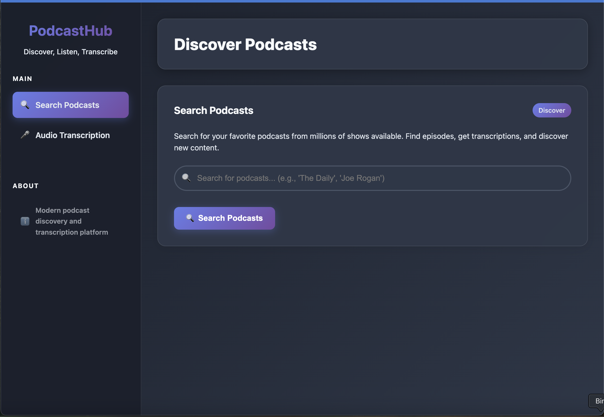

# Podcast App

A modern, responsive podcast application built with React, featuring a beautiful dashboard interface, PWA support, and offline capabilities.



## ✨ Features

- 🎧 Browse and search podcasts
- 📱 Responsive design that works on all devices
- 🌓 Light/Dark mode support
- ⚡ Progressive Web App (PWA) with offline support
- 🎨 Modern UI with smooth animations
- 📱 Installable on mobile devices
- 🔔 Browser notifications
- 🚀 Real-time audio transcription
- 🔄 WebSocket support for live updates

## 🚀 Getting Started

### Prerequisites

- Node.js 16+ and npm 8+
- Modern web browser
- Python 3.8+ (for audio transcription)
- FFmpeg (for audio processing)

### Installation

1. Clone the repository:

```bash
git clone https://github.com/yourusername/podcast-app.git
cd podcast-app
```

2. Install server dependencies:

```bash
npm install
```

3. Install client dependencies:

```bash
cd client
npm install
cd ..
```

### Running the Application

1. Start the server:

```bash
npm run dev
```

2. In a separate terminal, start the client:

```bash
npm run client
```

3. Open your browser and navigate to `http://localhost:3000`

## 📁 Project Structure

```
├── client/                # Frontend React application
│   ├── public/            # Static assets
│   └── src/               # React source code
│       ├── components/    # React components
│       ├── contexts/      # React contexts
│       ├── hooks/         # Custom React hooks
│       ├── styles/        # CSS styles
│       └── utils/         # Utility functions
├── server/                # Backend Node.js application
│   ├── config/            # Server configuration
│   ├── controllers/       # Request controllers
│   ├── middleware/        # Express middleware
│   ├── models/            # Data models
│   ├── routes/            # API routes
│   ├── services/          # Business logic
│   ├── utils/             # Utility functions
│   └── websocket/         # WebSocket handlers
├── shared/                # Shared code between client and server
│   ├── constants/         # Shared constants
│   └── types/             # Shared type definitions
└── docs/                  # Documentation
```

## 🔧 Configuration

Create a `.env` file in the server directory with the following variables:

```env
PORT=3001
NODE_ENV=development
WHISPER_MODEL=base  # or 'small', 'medium', 'large' based on your needs
```

## 🛠️ Development

```bash
# Start the backend server
npm run dev

# In a new terminal, start the frontend
npm run client
```

The app will be available at [http://localhost:3000](http://localhost:3000)

## 🛠 Available Scripts

### Root Directory
- `npm run dev` - Starts the backend server with hot-reload
- `npm run client` - Starts the frontend development server
- `npm test` - Launches the test runner

### Client Directory
- `npm start` - Starts the frontend development server
- `npm run build` - Builds the app for production to the `dist` folder

## 🏗 Project Architecture

### Client Structure
```
client/
├── public/            # Static assets and HTML template
└── src/               # React source code
    ├── components/    # React components
    │   ├── common/    # Common UI components
    │   └── podcast/   # Podcast-specific components
    ├── contexts/      # React contexts
    ├── hooks/         # Custom React hooks
    ├── styles/        # CSS styles
    └── utils/         # Utility functions
```

### Server Structure
```
server/
├── config/           # Server configuration
├── controllers/      # Request controllers
├── middleware/       # Express middleware
├── models/           # Data models
├── routes/           # API routes
├── services/         # Business logic
├── utils/            # Utility functions
└── websocket/        # WebSocket handlers
```

## 🛠 Development Guide

### Key Refactoring Improvements

#### 1. Backend Architecture
- **Modular Controllers**: Separated concerns with dedicated controllers
- **Service Layer**: Business logic encapsulated in service classes
- **WebSocket Support**: Real-time updates for transcription
- **API Documentation**: Auto-generated with Swagger

#### 2. Frontend Improvements
- **Component-Based Architecture**: Reusable, maintainable components
- **State Management**: Context API for global state
- **Responsive Design**: Works on all device sizes
- **Progressive Enhancement**: Core functionality works without JavaScript

#### 3. Security Enhancements
- File upload validation
- Proper CORS handling
- Input sanitization
- Secure file storage

## 📱 PWA Features

This app is a Progressive Web App, which means:

- Works offline
- Installable on your device's home screen
- Fast loading with service worker caching
- Push notifications support

## 🌈 Theming

The app supports both light and dark modes, which automatically adapts to your system preferences. You can also toggle between themes manually in the settings.

## 🧪 Testing

Run the test suite with:
```bash
npm test
```

## 📚 API Documentation

Access the interactive API documentation at `/api-docs` when the development server is running.

## 🤝 Contributing

1. Fork the repository
2. Create a feature branch (`git checkout -b feature/AmazingFeature`)
3. Commit your changes (`git commit -m 'Add some AmazingFeature'`)
4. Push to the branch (`git push origin feature/AmazingFeature`)
5. Open a Pull Request

Please read [CONTRIBUTING.md](CONTRIBUTING.md) for details on our code of conduct and the process for submitting pull requests.

## 📄 License

This project is licensed under the MIT License - see the [LICENSE](LICENSE) file for details.

## 🙏 Acknowledgments

- Built with [React](https://reactjs.org/)
- Styled with [Tailwind CSS](https://tailwindcss.com/)
- Icons from [React Icons](https://react-icons.github.io/react-icons/)
- State management with [React Context API](https://reactjs.org/docs/context.html)
- Audio transcription with [OpenAI Whisper](https://openai.com/research/whisper)
- Real-time updates with [Socket.IO](https://socket.io/)
